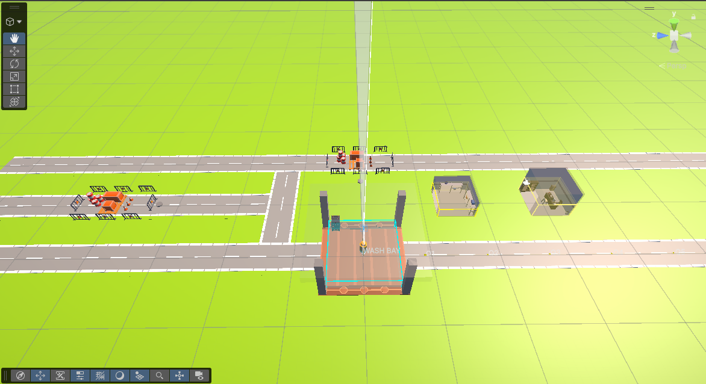
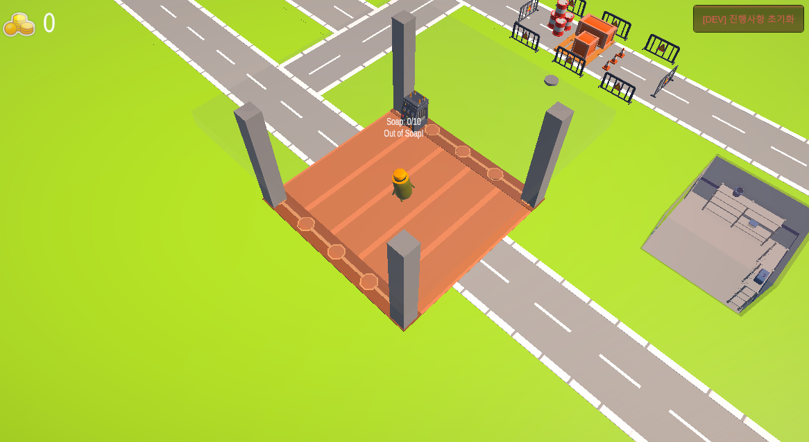
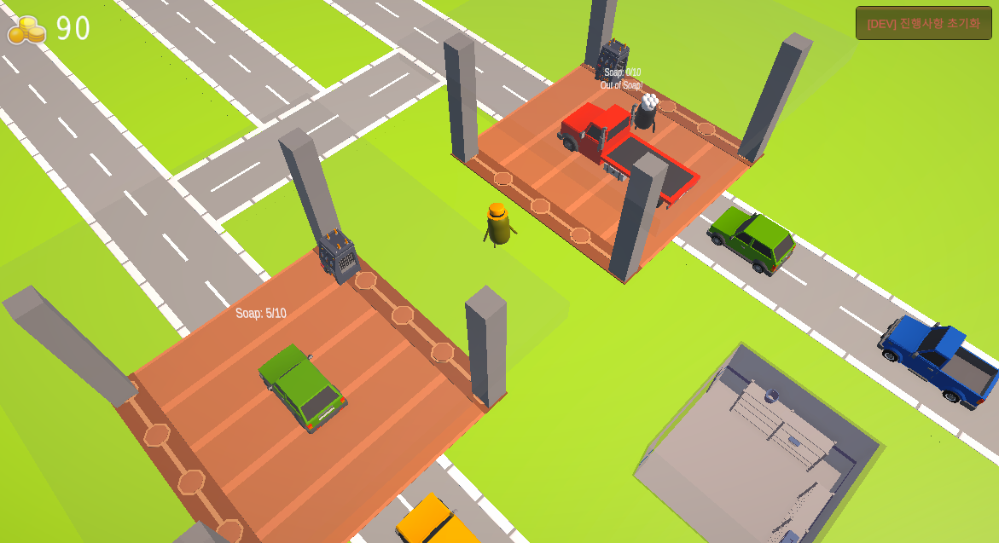
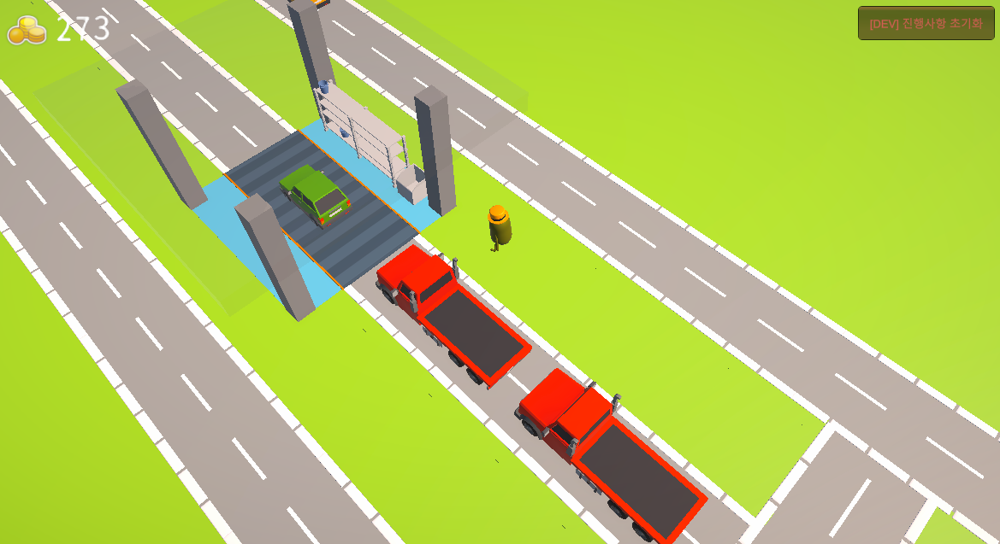
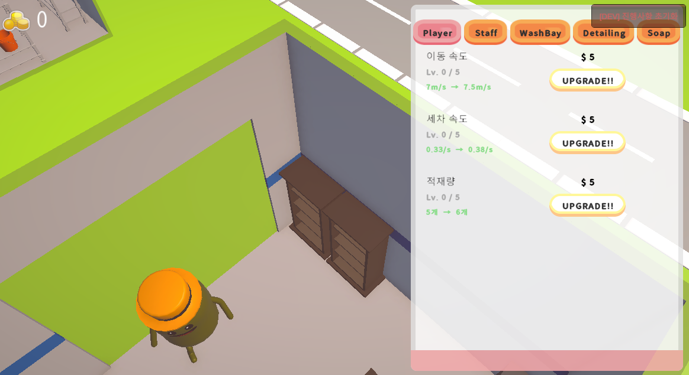
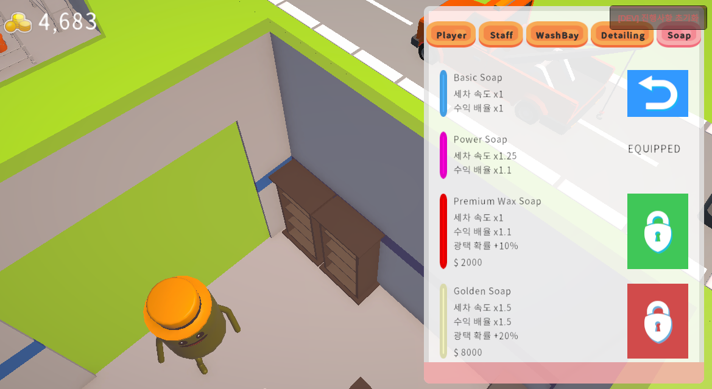
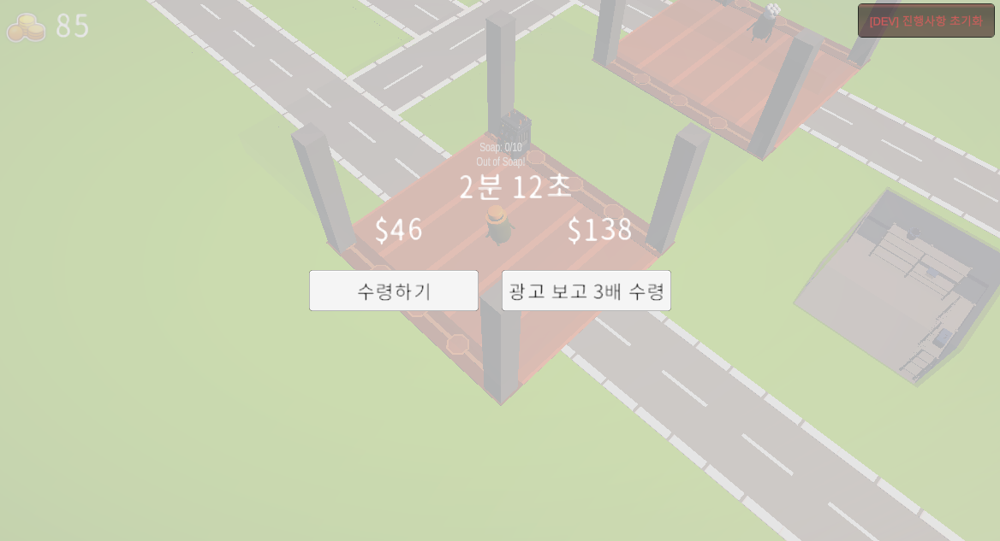

# Shiny Ready!

**세차 아케이드 타이쿤** · Unity 2022.3 LTS (URP) · C# · Android / iOS

> Pizza Ready! (Supercent) 레퍼런스 기반의 하이퍼캐주얼 타이쿤.  
> 세차장을 운영하며 구역을 확장하고 직원을 고용해 자동화된 세차 왕국을 만든다.

---

## 스크린샷

| 메인 씬 | 플레이 화면 | 구역 해금 |
|---|---|---|
|  |  |  |

| 광택 구역 | 업그레이드 | 비누 상점 | 오프라인 보상 |
|---|---|---|---|
|  |  |  |  |

---

## 게임플레이 흐름

```
플레이어 이동 → 세제 보충 → 세차 베이 세차 → 코인 수집
                                    ↓
                            확률적 광택 구역(Detailing) 진입
                                    ↓
                         고액 수익 + URP Smoothness 시각 효과
```

---

## 주요 구현 내용

### 플레이어 조작
- Unity **Enhanced Touch API** 기반 다이나믹 조이스틱 (터치 위치에 즉시 생성)
- 카메라 기준 이동 방향 · `CharacterController` · `Slerp` 스무스 회전
- 에디터에서는 마우스로 동일한 로직 (`#if UNITY_EDITOR`)

### 자동차 큐 시스템
| 단계 | 내용 |
|------|------|
| 스폰 | 배열에서 랜덤 선택, VIP 확률 판정 후 분리 풀에서 스폰 |
| 대기 | Waypoint 배열 기반 큐, 앞차 출발 시 자동 전진 |
| 세차 | WashingInteraction에 도킹, 진행도 기반 처리 |
| 분기 | 세차 완료 후 광택 구역 확률 판정 → Detailing / Exit |

### 세차 인터랙션 (`WashingInteraction`)
- `Progress 0 → 1` 진행도 기반 세차 — 여러 배율을 합산해 최종 속도 결정
  ```
  speed = baseWashSpeed × soapMult × adBuffMult / carWashTimeMult
  ```
- **플레이어 단독 / 직원 자동 / 혼합** 모드 전환
- 세제 소모 · 파티클 색상 · 사운드 FX 연동

### 광택 구역 (`DetailingZone`)
- 4슬롯 대기 큐 + EntryPoint 방향 정렬 → 차량 자연스럽게 진입
- 완료 시 차량 Material에 URP **`_Smoothness`** 수치 직접 적용
- 세차 대비 낮은 속도·높은 수익 설계

### 업그레이드 시스템 — 11종
| 카테고리 | 항목 |
|----------|------|
| 플레이어 | 이동 속도 · 세차 속도 · 세제 소지량 |
| 직원 | 작업 속도 · 팁 확률 · 팁 금액 |
| 세차 베이 | 세제 한도 · 고가 차량 확률 |
| 광택 구역 | 광택 속도 · 수익 배율 · 진입 확률 |

- 구역 해금 레벨 게이팅 · `OnUpgradeChanged` 이벤트로 UI 즉시 반영

### 광고 수익화 BM
| 기능 | 내용 |
|------|------|
| **Ad Buff** | 광고 시청 후 180초간 세차 속도 ×1.5 · 수익 ×2 |
| **오프라인 보상** | 최대 2시간 방치 보상, 효율 30%, 광고 3배 수령 선택지 |

- 오프라인 보상 계산식: `offlineSeconds × washSpeed × staffMult × moneyPerWash × bayCount × efficiency`
- `OnApplicationPause` / `OnApplicationQuit` 에서 UTC 시각 저장 → 재실행 시 복원

### 구역 해금 (`UnlockZone`)
- 선행 구역 조건 체인 (`_requiredZoneSaveId`)
- 해금 시 오브젝트 활성화 + 직원 스폰 + 자동화 연결 + 플레이스홀더 제거
- PlayerPrefs 저장 → 재시작 시 해금 상태 완전 복원

### 비누 상점 (ScriptableObject 기반)
| 비누 | 속도 | 수익 | 광택 확률 보너스 |
|------|------|------|------|
| Basic Soap | ×1.0 | ×1.0 | +0% |
| Power Soap | ×1.3 | ×1.0 | +5% |
| Premium Wax | ×1.5 | ×1.25 | +10% |
| Golden Soap | ×2.0 | ×1.5 | +20% |

---

## 기술 스택

| 분류 | 내용 |
|------|------|
| 엔진 | Unity 2022.3 LTS |
| 렌더링 | URP (Universal Render Pipeline) |
| 입력 | Unity Input System (Enhanced Touch) |
| 언어 | C# |
| 저장 | PlayerPrefs |
| 아키텍처 | Singleton Manager + Event-driven + Component Composition |

---

## 프로젝트 구조

```
Assets/_Project/Scripts/
├── Player/         PlayerController, CameraFollow
├── _Car/           Car, CarSpawner, CarData
├── Cleaning/       WashingInteraction, DetailingZone, SoapSystem, StaffController
├── Currency/       CurrencyManager, MoneyPickup
├── Upgrade/        UpgradeManager, UpgradeData (ScriptableObject)
├── Zone/           UnlockZone, UnlockZonePopupUI
├── Ads/            AdBuffManager, OfflineRewardManager
├── Audio/          SoundManager
├── Save/           GameSaveManager
└── UI/             UIManager, UpgradePanel, SoapShopUI, AdBuffTimerUI, ...
```

---

## 싱글톤 목록

`CurrencyManager` · `UpgradeManager` · `SoapInventoryManager` · `SoundManager` · `AdBuffManager` · `OfflineRewardManager` · `GameSaveManager`

---

## PlayerPrefs 저장 키

| 키 | 내용 |
|------|------|
| `Currency_Money` | 보유 재화 |
| `ZoneLevel` | 구역 해금 레벨 |
| `Upg_{AssetName}` | 업그레이드 레벨 (항목별) |
| `Zone_{SaveId}` | 구역 해금 여부 |
| `SoapInventory_*` | 비누 해금·장착 상태 |
| `OfflineEarnings_LastSessionTime` | 마지막 세션 종료 시각 (UTC ISO 8601) |

---

## 설계 포인트

- **배율 합산 구조** — 속도/수익 배율을 컴포넌트별로 분리해 독립 확장 가능
- **이벤트 기반 디커플링** — 매니저 간 직접 참조 대신 이벤트(`Action<T>`)로 연결
- **안전한 코인 스폰** — 기존 코인 간격 + 차량 반경 검사, 실패 시 원형 균등 배치로 폴백
- **런타임 활성화 안전성** — `OnEnable()`에서 큐·타이머 리셋 → UnlockZone 동적 활성화 대응
- **에디터 Gizmos** — 스폰/웨이포인트/베이 구역을 색상 구분 와이어프레임으로 시각화

---

*상세 포트폴리오: [docs/portfolio.md](./docs/portfolio.md)*
*플레이 데모 영상: [Notion](https://app.notion.com/p/notion_portfolio-37d6288128658062b75ed3e1e877313f?source=copy_link)*
