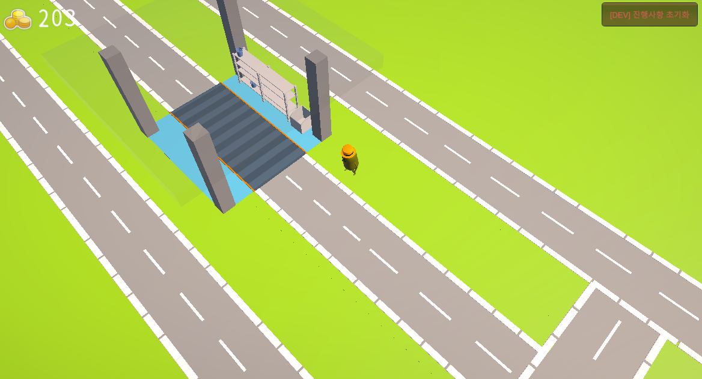
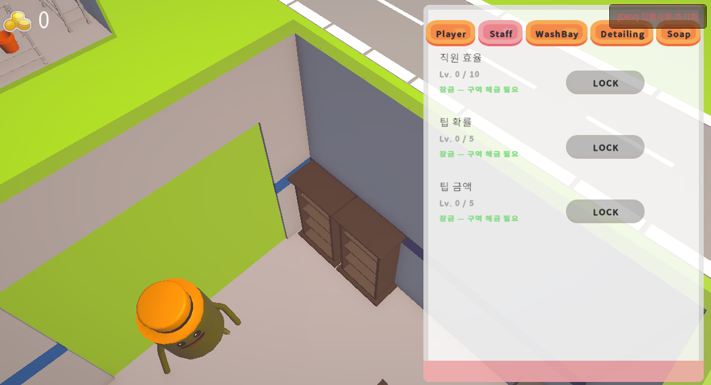
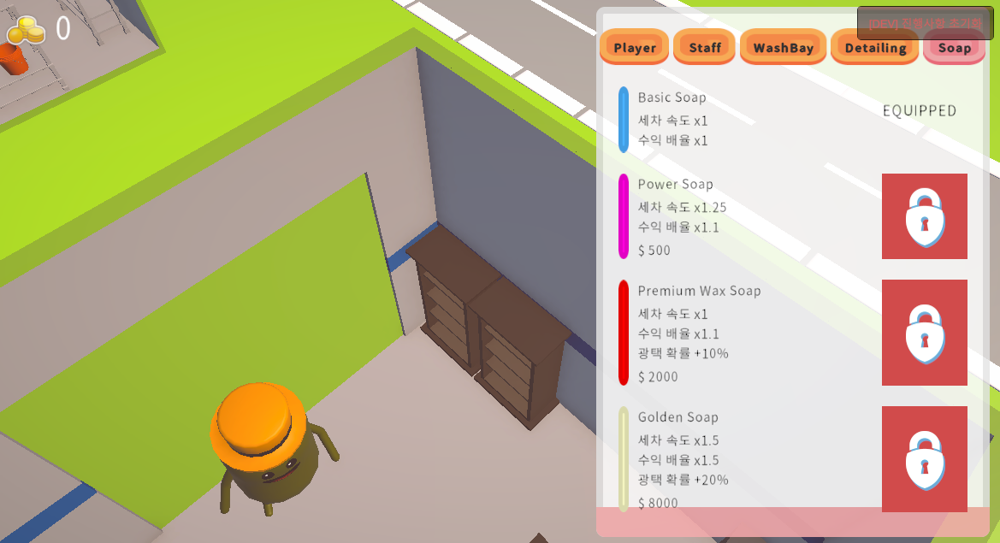

# Shiny Ready! — 포트폴리오

## 프로젝트 개요

| 항목 | 내용 |
|------|------|
| 프로젝트명 | Shiny Ready! |
| 장르 | 하이브리드/하이퍼캐주얼 아케이드 타이쿤 |
| 레퍼런스 | Pizza Ready! (Supercent) |
| 엔진 | Unity 2022.3 LTS (URP) |
| 언어 | C# |
| 플랫폼 | Android / iOS |
| 개발 기간 | 2026년 상반기 |
| 역할 | 1인 개발 (기획 · 프로그래밍 · 씬 구성) |

### 한 줄 요약

가상 조이스틱으로 세차장을 직접 운영하고, 구역 확장·직원 고용·업그레이드로 자동화된 타이쿤을 구축하는 모바일 아케이드 게임.

### 메인 화면

| 메인 씬 | 플레이 화면 |
|---|---|
|  |  |

---

## 구현 시스템 상세

### 1. 플레이어 이동 시스템

**목표:** 모바일 터치에 자연스러운 다이나믹 조이스틱 구현

Unity **Enhanced Touch API**를 활용해 터치가 시작된 화면 좌표에 즉시 조이스틱이 생성되는 방식을 구현했다. 고정 위치 조이스틱 대비 손가락 위치를 자유롭게 선택할 수 있어 하이퍼캐주얼 게임에 적합하다.

```csharp
// 터치 시작 좌표를 조이스틱 원점으로 설정
_joystickOrigin = touch.screenPosition;
ShowJoystick(_joystickOrigin);

// 반경 클램핑 후 정규화 → 입력 방향 벡터
Vector2 clamped = Vector2.ClampMagnitude(delta, _joystickRadius);
_inputDirection = clamped / _joystickRadius;
```

카메라 기준 이동 방향을 계산해 카메라가 회전해도 직관적인 조작이 유지된다. 에디터에서는 동일한 로직을 마우스로 시뮬레이션해 터치 디바이스 없이도 개발할 수 있다.

**기술 포인트:**
- `CharacterController.Move()`로 물리 연산 — `transform.position` 직접 수정 대신 충돌 처리 자동화
- 이동 방향 변경 시 `Quaternion.Slerp`로 부드러운 회전
- Animator `StringToHash`로 문자열 룩업 비용 제거

---

### 2. 자동차 큐 & 라우팅 시스템

**목표:** 세차장 게임의 핵심인 차량 흐름을 자연스럽게 표현

`CarSpawner`가 차량 생성·대기·라우팅의 전체 흐름을 담당한다.

```
[Spawn] → [QueueWaypoints 0~3] → [WashBay] → (확률 판정) → [DetailingZone] or [Exit]
```

**VIP 차량 시스템:** `CarData` 컴포넌트에 `IsVip`, `WashTimeMultiplier`, `MoneyMultiplier`를 분리해 ScriptableObject 없이 프리팹 단위로 차량 특성을 정의했다. 스폰 시 일반/VIP 풀을 분리해 선택하며, 해당 풀이 비어 있으면 전체 풀로 폴백한다.

**광택 분기:** 세차 완료 후 확률 판정으로 DetailingZone에 라우팅한다. Decision Point를 경유하도록 설정하면 분기점 도착 시 재확인(다른 차가 선점했을 가능성)해 안전하게 처리한다.

**기술 포인트:**
- `OnEnable()`에서 큐·타이머 완전 리셋 → UnlockZone의 동적 활성화 시에도 안전
- 코인 스폰 위치를 차량 출발 0.4초 후에 생성해 차 위 겹침 방지
- 기존 코인 간격 검사 후 실패 시 원형 균등 배치로 폴백

---

### 3. 세차 인터랙션 시스템

**목표:** 플레이어·직원·자동화가 공존하는 유연한 세차 로직

`WashingInteraction`은 단일 컴포넌트로 세 가지 운영 모드를 처리한다.

| 모드 | 조건 |
|------|------|
| 플레이어 단독 | `_playerInside = true` |
| 직원 자동 | `isAutomated = true`, 플레이어 없을 때 직원이 대체 |
| 혼합 | 플레이어 있을 때 직원은 유휴 상태로 전환 |

**속도 배율 합산 구조:**
```csharp
float speedMult = equippedSoap.washSpeedMultiplier;
if (!_playerInside && staffPresent)
    speedMult *= _staffWashSpeedMultiplier;       // 직원 패널티
float adSpeedMult = AdBuffManager.Instance.WashSpeedMultiplier; // 광고 버프
float washTimeMult = _carSpawner.CurrentCarWashTimeMultiplier;  // 차종 난이도

Progress += _baseWashSpeed * speedMult * adSpeedMult / washTimeMult * Time.deltaTime;
```

각 배율 인자가 독립 컴포넌트에서 관리되어 새 요소(예: 날씨 디버프) 추가 시 해당 줄만 수정하면 된다.

**기술 포인트:**
- `_playerInside` 플래그는 `OnTriggerEnter/Exit`로만 변경 — 세제 리필 로직과 명확히 분리
- 세제 소모는 세차 완료 시 1회만 차감 (진행 도중 차감 없음)
- `SyncFoamColor(SoapData)` — 장착한 세제 종류에 따라 파티클 색상 즉시 변경

---

### 4. 광택 구역 (DetailingZone)

**목표:** 세차보다 희귀하고 고수익인 프리미엄 서비스 구현

세차 완료 차량을 확률적으로 받아 4슬롯 대기 줄을 관리한다. EntryPoint를 경유해 차량이 자연스럽게 진입 방향을 정렬한다.

**주요 설계 결정:**

`_awaitingEntry` HashSet으로 EntryPoint를 아직 통과하지 않은 차량을 추적한다. 슬롯 전진 시 이 차량들은 건드리지 않고, EntryPoint 도착 콜백에서 현재 슬롯을 동적으로 계산한다. 이렇게 하면 진입 중에 앞 차가 빠져나가도 올바른 슬롯에 안착한다.

**URP Smoothness 시각 효과:**
```csharp
foreach (var mat in rend.materials)
{
    if      (mat.HasProperty("_Smoothness")) mat.SetFloat("_Smoothness", _smoothnessTarget);
    else if (mat.HasProperty("_Glossiness")) mat.SetFloat("_Glossiness", _smoothnessTarget);
}
```
빌트인 렌더러와 URP 양쪽 Material 프로퍼티 이름 차이를 처리해 호환성 확보.

| 대기열 진입 | 작업 중 |
|---|---|
|  |  |

---

### 5. 업그레이드 시스템

**목표:** 수치 변경이 즉시 게임플레이에 반영되는 확장 가능한 구조

`UpgradeData` ScriptableObject에 레벨별 수치·비용·구역 조건을 정의하고, `UpgradeManager`가 로드·적용·UI 갱신을 중앙에서 처리한다.

```csharp
public bool TryUpgrade(UpgradeData data)
{
    if (data.IsMaxLevel) return false;
    if (_zoneLevel < data.requiredZoneLevel) return false;   // 구역 잠금
    if (!CurrencyManager.Instance.SpendMoney(data.UpgradeCost)) return false;

    data.TryLevelUp();
    // 해당 데이터에 맞는 Apply 메서드 즉시 호출
    ApplyPlayerMoveSpeed();   // or 다른 Apply 메서드
    OnUpgradeChanged?.Invoke();
    return true;
}
```

**팁 시스템:** `staffTipChance`와 `staffTipAmount`는 `CarSpawner.OnWashComplete` 이벤트 구독으로 처리한다. 세차 완료 이벤트마다 확률 계산 → 조건 충족 시 재화 지급. 별도 컴포넌트 없이 업그레이드 수치만 올리면 팁이 발생하기 시작한다.

| 업그레이드 패널 | 구역 잠금 상태 |
|---|---|
|  |  |

비누 4종은 해금 비용·속도·수익 배율을 한눈에 비교할 수 있도록 상점 UI에 표시한다.

| 비누 상점 (잠금) | 비누 상점 (장착) |
|---|---|
|  |  |

---

### 6. 광고 수익화 BM

#### Ad Buff

광고 시청 후 180초간 세차 속도 ×1.5 · 수익 ×2 버프를 제공한다. 버프 비활성 시 배율을 1f로 반환하므로 기존 로직에 영향을 주지 않는다.

```csharp
public float WashSpeedMultiplier => IsBuffActive ? _washSpeedMultiplier : 1f;
public float IncomeMultiplier    => IsBuffActive ? _incomeMultiplier    : 1f;
```

이미 활성 중일 때 재시청하면 지속 시간을 최대치로 갱신(중첩 아님)해 어뷰징 방지.

#### 오프라인 보상

앱 종료·일시정지 시 UTC 시각을 PlayerPrefs에 저장하고, 재실행 시 방치 시간을 계산한다.

```
보상액 = Min(방치초, 7200) × washSpeed × staffMult × moneyPerWash × 자동화베이수 × 0.3(효율)
```

최대 2시간 캡과 30% 효율 패널티로 오프라인 보상이 온라인을 압도하지 않게 설계했다. 광고 시청 시 3배 수령 선택지를 제공해 광고 노출을 유도한다.


---

### 7. 구역 해금 시스템

**목표:** 순서가 있는 구역 확장을 저장하고 복원

`_requiredZoneSaveId`로 선행 구역 조건을 체인처럼 연결할 수 있다. 해금 시 수행되는 작업:

1. 재화 차감
2. `_targetObject` 활성화 (새 구역 건물/콘텐츠)
3. `UpgradeManager.ZoneLevel` 증가 (잠긴 업그레이드 해제)
4. 직원 오브젝트 활성화 + `WashingInteraction`에 연결
5. 플레이스홀더 오브젝트 제거
6. PlayerPrefs 저장

`Start()`에서 저장 키를 확인해 이미 해금된 구역을 씬 로드 시 자동으로 복원한다.


---

## 아키텍처

### 싱글톤 구성

| 매니저 | 역할 |
|--------|------|
| `CurrencyManager` | 재화 저장/지출, `OnMoneyChanged` 이벤트 |
| `UpgradeManager` | 업그레이드 로드·적용, `OnUpgradeChanged` 이벤트 |
| `SoapInventoryManager` | 비누 해금·장착, `OnSoapChanged` 이벤트 |
| `AdBuffManager` | 버프 타이머, `OnBuffStateChanged/TimeUpdated` 이벤트 |
| `OfflineRewardManager` | 방치 보상 계산 및 지급 |
| `SoundManager` | 효과음 재생 |
| `GameSaveManager` | 전체 데이터 초기화 |

### 이벤트 흐름

```
CarSpawner.OnWashComplete
    ├── UpgradeManager  → 팁 확률 계산
    └── (화폐 스폰은 CarSpawner 자체 처리)

UpgradeManager.OnUpgradeChanged
    └── UpgradePanel    → 버튼 상태·비용 갱신

AdBuffManager.OnBuffStateChanged
    └── AdBuffTimerUI   → HUD 표시/숨김

CurrencyManager.OnMoneyChanged
    └── UIManager       → 재화 HUD 갱신
```

### 모바일 최적화

- `Update()`에서 `GetComponent<>()` 제거 — 모든 참조는 `Awake()`에서 캐싱
- Animator 파라미터 `StringToHash`로 문자열 룩업 제거
- `FindObjectOfType()` 미사용 — 싱글톤 Instance 또는 Inspector 직접 참조
- 코인 오브젝트 스폰은 지연 코루틴으로 차 위 Z-fighting 방지

---

## 배운 점 / 트러블슈팅

### 세제 리필과 플레이어 감지 분리

초기에 `SoapRefillPoint`가 `_playerInside` 플래그를 직접 수정하는 구조였다. 리필 키오스크 근처에서 세차 베이 트리거와 겹칠 때 플래그가 오염되는 버그가 발생했다. `_playerInside`를 `WashingInteraction` 내부에만 두고, 리필은 별도의 콜백(`AddSoap()`)으로 주입하는 방식으로 분리해 해결했다.

### 광택 구역 대기열 슬롯 충돌

EntryPoint를 통과 중인 차량이 슬롯 전진 로직과 충돌해 동시에 같은 슬롯으로 이동하는 문제가 있었다. `_awaitingEntry` HashSet으로 진입 대기 차량을 별도 추적하고, 해당 차는 EntryPoint 도착 콜백에서 동적으로 슬롯을 계산하도록 수정했다.

### 동적 활성화 시 이전 상태 잔류

UnlockZone이 런타임에 `GameObject.SetActive(true)`로 베이를 활성화할 때 이전 큐 상태가 남아있는 문제. `OnEnable()`에서 큐·타이머·차량을 모두 리셋하는 것으로 해결했다.

---

## 데모 영상

플레이 영상(7종)은 용량 문제로 저장소에는 포함하지 않고 Notion 페이지에 업로드했다.

**Notion 데모 페이지:** https://app.notion.com/p/notion_portfolio-37d6288128658062b75ed3e1e877313f?source=copy_link

| 영상 | 내용 |
|------|------|
| 1 | 기본 세차 루프 — 세제 보충 & 코인 획득 |
| 2 | 광택 구역(Detailing Zone) 진입 |
| 3 | 광택 작업 & 완료 보상 |
| 4 | 업그레이드 시스템 — 진행 및 적용 확인 |
| 5 | 비누 상점 — 장착 & 교체 |
| 6 | 구역 해금 #1 — 직원 자동화 (WashBay02) |
| 7 | 구역 해금 #2 — 광택 구역 오픈 & 추가 자동화 (WashBay01) |

---

*Unity 2022.3 LTS · URP · C# · Android/iOS*
